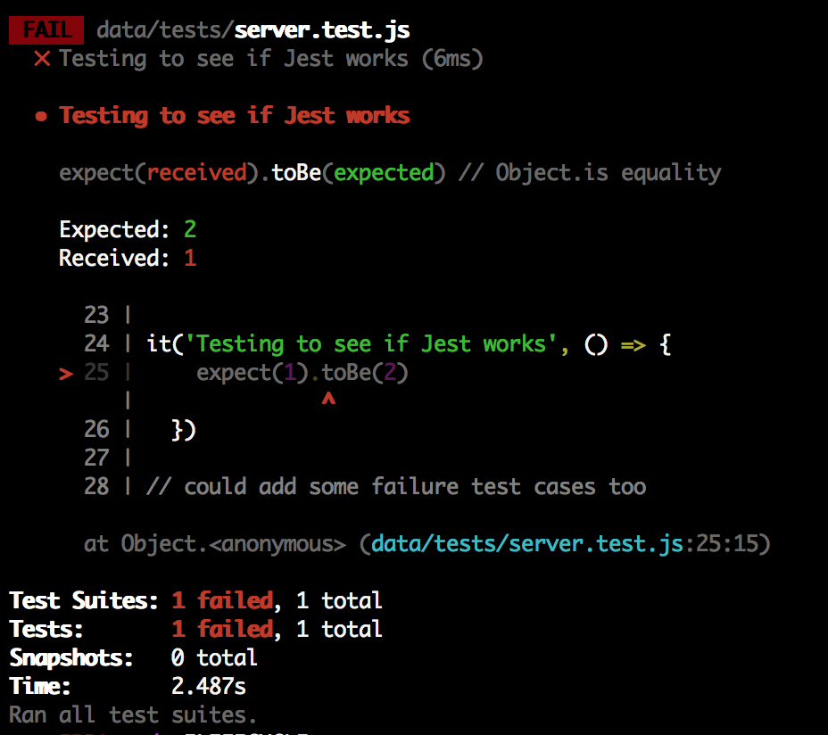
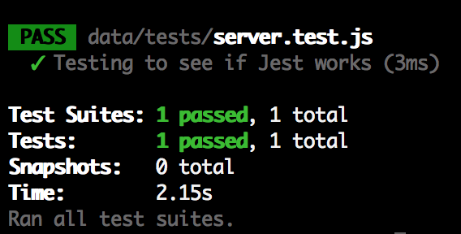

### Writing your first test
Ok this is the exciting bit! We get to write our first test!!

A few things before we get stuck in, Jest has 3 words that you can use:
- `describe` : this lets you wrap a bunch of related tests together, it's used for organising test (we don't need to worry about it for now).
- `it` : lets you run a test. We need this in every test!
- `expect` : lets you write assertions. The tests pass if the assertions pass.

Dont' worry this will all make sense when we start writing some tests.

In your `server.test.js` file we can write an example of a failing test. Go ahead and write the following in your `server.test.js` file:

```
it('Testing to see if Jest works', () => {
  expect(1).toBe(2)
})
```
This test will fail as 1 does not equal 2.

### Running your tests
To run your tests just run `npm run test` on the command line.

You should see something like this:




Now to make those tests pass, change your code to
```
it('Testing to see if Jest works', () => {
  expect(1).toBe(1)
})
```

Now run the test again, `npm run test`



Wooohoo! A passing test! Let's move onto the next step.