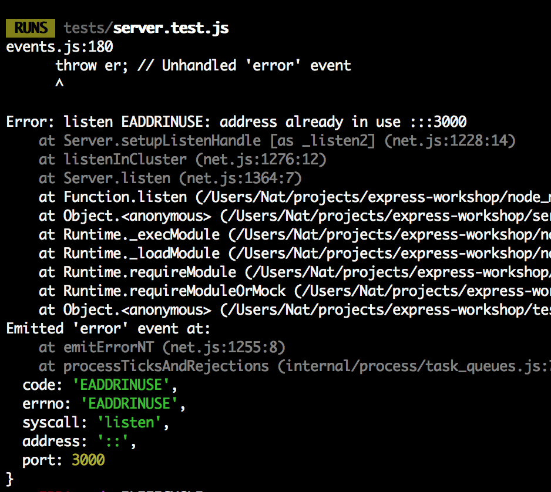

### Testing Our First Endpoint

Let's test the `/get-posts` endpoint

```
it('get endpoint', () => {
    const response = request.get('/get-posts')
    expect(response.status).toBe(200)
})
```
Ok, so now that we are testing the server, we should get it up and running

`npm run start`

Now in another tab, lets run our test

`npm run test`

Hmmmm something has gone wrong... You probably see something like this in your terminal




Try have a guess why this is happening then head to the next step for the answer.