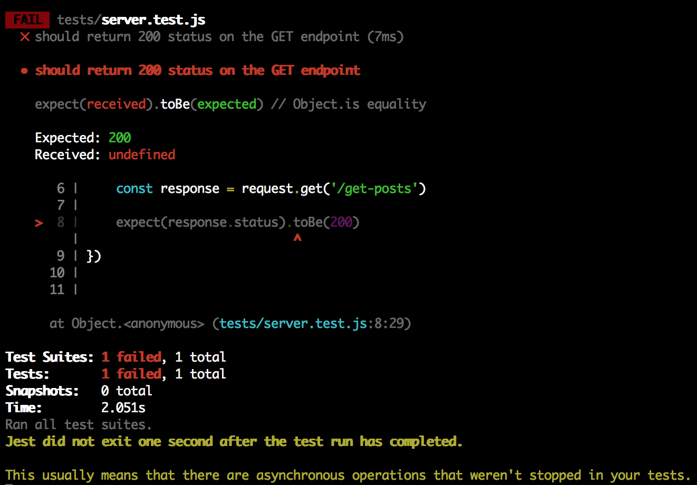

### Asynchronous Testing

  Now let's restart the server `npm run start` and run those tests again, `npm run test`

  Oh dear, another problem

  


Any guesses on what might be happening?

_____

### What is the issue??
The final line "asynchronous operations weren't stopped" might give us a clue.

Remember how Node is asynchronous? Well the same goes for our tests, they also need to handle requests asynchronously.

Luckily it's pretty easy with Jest, we need to use the `async`, `await` and `done` keywords.

Let's re-write our test to include these keywords

___

```
it('get endpoint', async done => {
    const response = await request.get('/get-posts')

    expect(response.status).toBe(200)

    done()
})
```

Let's break this down:
 - The `async` function is always coupled with an `await` expression.
 - The `async` function will wait until the `await` expression has completed, in our case the get request. Once that has completed the function will continue. 
 - The `done` keyword lets Jest know that your tests are finished.

____

Ok, we should be set to run the test again
```
npm run test
```


A passing test!! We did it!